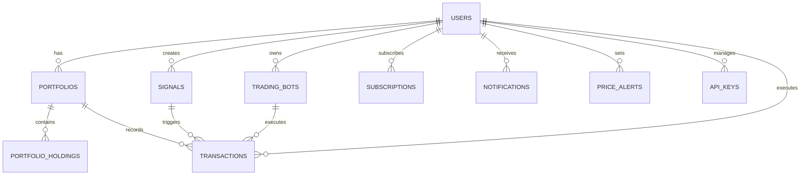

# 🗄️ MONSTA 데이터베이스 스키마

## 📊 데이터베이스 구조 개요

### 기술 스택
- **Primary DB**: PostgreSQL 14+
- **Cache**: Redis 6+
- **Time Series**: TimescaleDB
- **Search**: Elasticsearch
- **Queue**: Redis Queue

## 📋 핵심 테이블 스키마

### 1. Users (사용자)
```sql
CREATE TABLE users (
    id UUID PRIMARY KEY DEFAULT gen_random_uuid(),
    email VARCHAR(255) UNIQUE NOT NULL,
    username VARCHAR(50) UNIQUE NOT NULL,
    password_hash VARCHAR(255) NOT NULL,
    
    -- Profile
    full_name VARCHAR(100),
    avatar_url VARCHAR(500),
    bio TEXT,
    country VARCHAR(2),
    language VARCHAR(5) DEFAULT 'ko',
    timezone VARCHAR(50) DEFAULT 'Asia/Seoul',
    
    -- Role & Hierarchy (영업 구조)
    user_role VARCHAR(20) DEFAULT '구독자',
    parent_user_id UUID REFERENCES users(id),
    commission_rate DECIMAL(5, 2) DEFAULT 0, -- 수수료율 (%)
    
    -- Subscription
    subscription_tier VARCHAR(20) DEFAULT 'FREE',
    subscription_start_date TIMESTAMP,
    subscription_end_date TIMESTAMP,
    is_lifetime BOOLEAN DEFAULT FALSE,
    
    -- Status
    is_active BOOLEAN DEFAULT TRUE,
    is_verified BOOLEAN DEFAULT FALSE,
    is_admin BOOLEAN DEFAULT FALSE,
    last_login TIMESTAMP,
    
    -- Security
    two_factor_enabled BOOLEAN DEFAULT FALSE,
    two_factor_secret VARCHAR(255),
    
    -- Metadata
    created_at TIMESTAMP DEFAULT CURRENT_TIMESTAMP,
    updated_at TIMESTAMP DEFAULT CURRENT_TIMESTAMP,
    deleted_at TIMESTAMP,
    
    CONSTRAINT check_subscription_tier 
        CHECK (subscription_tier IN ('FREE', 'SILVER', 'GOLD', 'PLATINUM', 'DIAMOND', 'BLACK')),
    CONSTRAINT check_user_role 
        CHECK (user_role IN ('본사', '총판', '대리점', '구독자', '게스트'))
);

-- Indexes
CREATE INDEX idx_users_email ON users(email);
CREATE INDEX idx_users_username ON users(username);
CREATE INDEX idx_users_subscription ON users(subscription_tier, subscription_end_date);
```

### 2. Signals (시그널)
```sql
CREATE TABLE signals (
    id UUID PRIMARY KEY DEFAULT gen_random_uuid(),
    
    -- Signal Info
    symbol VARCHAR(20) NOT NULL,
    type VARCHAR(20) NOT NULL, -- LONG, SHORT
    entry_price DECIMAL(20, 8) NOT NULL,
    target_price DECIMAL(20, 8) NOT NULL,
    stop_loss DECIMAL(20, 8) NOT NULL,
    
    -- AI Analysis
    confidence_score DECIMAL(5, 2) NOT NULL, -- 0-100
    ai_model VARCHAR(50) NOT NULL,
    analysis_data JSONB,
    
    -- Status
    status VARCHAR(20) DEFAULT 'PENDING',
    actual_price DECIMAL(20, 8),
    profit_loss DECIMAL(10, 2),
    
    -- Timing
    signal_time TIMESTAMP DEFAULT CURRENT_TIMESTAMP,
    expiry_time TIMESTAMP,
    closed_at TIMESTAMP,
    
    -- Access Control
    minimum_tier VARCHAR(20) DEFAULT 'FREE',
    
    -- Metadata
    created_by UUID REFERENCES users(id),
    created_at TIMESTAMP DEFAULT CURRENT_TIMESTAMP,
    updated_at TIMESTAMP DEFAULT CURRENT_TIMESTAMP,
    
    CONSTRAINT check_signal_type CHECK (type IN ('LONG', 'SHORT')),
    CONSTRAINT check_signal_status 
        CHECK (status IN ('PENDING', 'ACTIVE', 'HIT_TARGET', 'HIT_STOPLOSS', 'EXPIRED', 'CANCELLED'))
);

-- Indexes
CREATE INDEX idx_signals_symbol ON signals(symbol, signal_time DESC);
CREATE INDEX idx_signals_status ON signals(status);
CREATE INDEX idx_signals_tier ON signals(minimum_tier);
```

### 3. Portfolios (포트폴리오)
```sql
CREATE TABLE portfolios (
    id UUID PRIMARY KEY DEFAULT gen_random_uuid(),
    user_id UUID NOT NULL REFERENCES users(id) ON DELETE CASCADE,
    
    -- Portfolio Info
    name VARCHAR(100) NOT NULL,
    description TEXT,
    is_primary BOOLEAN DEFAULT FALSE,
    
    -- Performance
    total_value DECIMAL(20, 2) DEFAULT 0,
    total_cost DECIMAL(20, 2) DEFAULT 0,
    realized_pnl DECIMAL(20, 2) DEFAULT 0,
    unrealized_pnl DECIMAL(20, 2) DEFAULT 0,
    
    -- Settings
    base_currency VARCHAR(10) DEFAULT 'USD',
    is_public BOOLEAN DEFAULT FALSE,
    
    -- Metadata
    created_at TIMESTAMP DEFAULT CURRENT_TIMESTAMP,
    updated_at TIMESTAMP DEFAULT CURRENT_TIMESTAMP,
    
    UNIQUE(user_id, name)
);

-- Holdings
CREATE TABLE portfolio_holdings (
    id UUID PRIMARY KEY DEFAULT gen_random_uuid(),
    portfolio_id UUID NOT NULL REFERENCES portfolios(id) ON DELETE CASCADE,
    
    -- Asset Info
    symbol VARCHAR(20) NOT NULL,
    quantity DECIMAL(20, 8) NOT NULL,
    average_cost DECIMAL(20, 8) NOT NULL,
    
    -- Current Values
    current_price DECIMAL(20, 8),
    current_value DECIMAL(20, 2),
    profit_loss DECIMAL(20, 2),
    profit_loss_percent DECIMAL(10, 2),
    
    -- Metadata
    first_bought_at TIMESTAMP,
    last_updated TIMESTAMP DEFAULT CURRENT_TIMESTAMP,
    
    UNIQUE(portfolio_id, symbol)
);
```

### 4. Transactions (거래)
```sql
CREATE TABLE transactions (
    id UUID PRIMARY KEY DEFAULT gen_random_uuid(),
    user_id UUID NOT NULL REFERENCES users(id),
    portfolio_id UUID REFERENCES portfolios(id),
    
    -- Transaction Info
    type VARCHAR(20) NOT NULL,
    symbol VARCHAR(20) NOT NULL,
    quantity DECIMAL(20, 8) NOT NULL,
    price DECIMAL(20, 8) NOT NULL,
    fee DECIMAL(20, 8) DEFAULT 0,
    total_amount DECIMAL(20, 2) NOT NULL,
    
    -- Source
    exchange VARCHAR(50),
    exchange_order_id VARCHAR(100),
    signal_id UUID REFERENCES signals(id),
    bot_id UUID REFERENCES trading_bots(id),
    
    -- Metadata
    executed_at TIMESTAMP DEFAULT CURRENT_TIMESTAMP,
    created_at TIMESTAMP DEFAULT CURRENT_TIMESTAMP,
    
    CONSTRAINT check_transaction_type 
        CHECK (type IN ('BUY', 'SELL', 'DEPOSIT', 'WITHDRAW'))
);
```

### 5. Trading Bots (자동매매 봇)
```sql
CREATE TABLE trading_bots (
    id UUID PRIMARY KEY DEFAULT gen_random_uuid(),
    user_id UUID NOT NULL REFERENCES users(id),
    
    -- Bot Info
    name VARCHAR(100) NOT NULL,
    type VARCHAR(50) NOT NULL,
    strategy JSONB NOT NULL,
    
    -- Settings
    symbol VARCHAR(20) NOT NULL,
    investment_amount DECIMAL(20, 2) NOT NULL,
    max_position_size DECIMAL(20, 2),
    stop_loss_percent DECIMAL(5, 2),
    take_profit_percent DECIMAL(5, 2),
    
    -- Status
    is_active BOOLEAN DEFAULT FALSE,
    status VARCHAR(20) DEFAULT 'STOPPED',
    
    -- Performance
    total_trades INTEGER DEFAULT 0,
    winning_trades INTEGER DEFAULT 0,
    losing_trades INTEGER DEFAULT 0,
    total_profit_loss DECIMAL(20, 2) DEFAULT 0,
    
    -- Metadata
    created_at TIMESTAMP DEFAULT CURRENT_TIMESTAMP,
    started_at TIMESTAMP,
    stopped_at TIMESTAMP,
    
    CONSTRAINT check_bot_type 
        CHECK (type IN ('GRID', 'DCA', 'ARBITRAGE', 'MARKET_MAKER', 'CUSTOM'))
);
```

### 6. Subscriptions (구독)
```sql
CREATE TABLE subscriptions (
    id UUID PRIMARY KEY DEFAULT gen_random_uuid(),
    user_id UUID NOT NULL REFERENCES users(id),
    
    -- Plan Info
    tier VARCHAR(20) NOT NULL,
    price DECIMAL(10, 2) NOT NULL,
    currency VARCHAR(3) DEFAULT 'USD',
    
    -- Period
    start_date TIMESTAMP NOT NULL,
    end_date TIMESTAMP NOT NULL,
    is_active BOOLEAN DEFAULT TRUE,
    auto_renew BOOLEAN DEFAULT TRUE,
    
    -- Payment
    payment_method VARCHAR(50),
    payment_id VARCHAR(100),
    invoice_id VARCHAR(100),
    
    -- Metadata
    created_at TIMESTAMP DEFAULT CURRENT_TIMESTAMP,
    cancelled_at TIMESTAMP,
    
    CONSTRAINT check_tier 
        CHECK (tier IN ('FREE', 'SILVER', 'GOLD', 'PLATINUM', 'DIAMOND', 'BLACK'))
);
```

### 7. Notifications (알림)
```sql
CREATE TABLE notifications (
    id UUID PRIMARY KEY DEFAULT gen_random_uuid(),
    user_id UUID NOT NULL REFERENCES users(id),
    
    -- Notification Info
    type VARCHAR(50) NOT NULL,
    title VARCHAR(200) NOT NULL,
    message TEXT NOT NULL,
    data JSONB,
    
    -- Status
    is_read BOOLEAN DEFAULT FALSE,
    is_sent BOOLEAN DEFAULT FALSE,
    
    -- Channels
    email_sent BOOLEAN DEFAULT FALSE,
    push_sent BOOLEAN DEFAULT FALSE,
    telegram_sent BOOLEAN DEFAULT FALSE,
    
    -- Metadata
    created_at TIMESTAMP DEFAULT CURRENT_TIMESTAMP,
    sent_at TIMESTAMP,
    read_at TIMESTAMP
);
```

### 8. Price Alerts (가격 알림)
```sql
CREATE TABLE price_alerts (
    id UUID PRIMARY KEY DEFAULT gen_random_uuid(),
    user_id UUID NOT NULL REFERENCES users(id),
    
    -- Alert Conditions
    symbol VARCHAR(20) NOT NULL,
    condition VARCHAR(20) NOT NULL,
    target_price DECIMAL(20, 8) NOT NULL,
    
    -- Settings
    is_active BOOLEAN DEFAULT TRUE,
    is_recurring BOOLEAN DEFAULT FALSE,
    notification_channels VARCHAR[] DEFAULT ARRAY['PUSH'],
    
    -- Status
    triggered_count INTEGER DEFAULT 0,
    last_triggered_at TIMESTAMP,
    
    -- Metadata
    created_at TIMESTAMP DEFAULT CURRENT_TIMESTAMP,
    expires_at TIMESTAMP,
    
    CONSTRAINT check_condition 
        CHECK (condition IN ('ABOVE', 'BELOW', 'CROSS_UP', 'CROSS_DOWN'))
);
```

### 9. API Keys (API 키)
```sql
CREATE TABLE api_keys (
    id UUID PRIMARY KEY DEFAULT gen_random_uuid(),
    user_id UUID NOT NULL REFERENCES users(id),
    
    -- Key Info
    name VARCHAR(100) NOT NULL,
    key_hash VARCHAR(255) NOT NULL UNIQUE,
    key_prefix VARCHAR(20) NOT NULL, -- For display
    
    -- Permissions
    permissions VARCHAR[] DEFAULT ARRAY['READ'],
    ip_whitelist VARCHAR[],
    
    -- Usage
    last_used_at TIMESTAMP,
    usage_count INTEGER DEFAULT 0,
    
    -- Status
    is_active BOOLEAN DEFAULT TRUE,
    expires_at TIMESTAMP,
    
    -- Metadata
    created_at TIMESTAMP DEFAULT CURRENT_TIMESTAMP,
    revoked_at TIMESTAMP
);
```

### 10. Business Hierarchy (영업 계층 구조)
```sql
CREATE TABLE business_hierarchy (
    id UUID PRIMARY KEY DEFAULT gen_random_uuid(),
    user_id UUID NOT NULL REFERENCES users(id),
    
    -- Hierarchy Info
    level INTEGER NOT NULL, -- 1:본사, 2:총판, 3:대리점, 4:구독자
    parent_id UUID REFERENCES business_hierarchy(id),
    path TEXT, -- 계층 경로 (예: "본사ID/총판ID/대리점ID")
    
    -- Commission Settings
    commission_rate DECIMAL(5, 2) NOT NULL DEFAULT 0,
    commission_type VARCHAR(20) DEFAULT 'PERCENTAGE', -- PERCENTAGE, FIXED
    min_commission DECIMAL(10, 2) DEFAULT 0,
    max_commission DECIMAL(10, 2),
    
    -- 리퍼럴 시스템 (구독자용)
    referral_code VARCHAR(20) UNIQUE,
    referral_commission_rate DECIMAL(5, 2) DEFAULT 5.0, -- 구독자 리퍼럴 수수료 (기본 5%)
    referral_tier_bonus JSONB, -- 티어별 보너스 설정
    total_referrals INTEGER DEFAULT 0,
    active_referrals INTEGER DEFAULT 0,
    
    -- Performance
    total_sales DECIMAL(20, 2) DEFAULT 0,
    total_commission_earned DECIMAL(20, 2) DEFAULT 0,
    total_commission_paid DECIMAL(20, 2) DEFAULT 0,
    total_referral_commission DECIMAL(20, 2) DEFAULT 0, -- 리퍼럴로 얻은 수수료
    active_downlines INTEGER DEFAULT 0,
    
    -- Status
    is_active BOOLEAN DEFAULT TRUE,
    approved_at TIMESTAMP,
    approved_by UUID REFERENCES users(id),
    
    -- Metadata
    created_at TIMESTAMP DEFAULT CURRENT_TIMESTAMP,
    updated_at TIMESTAMP DEFAULT CURRENT_TIMESTAMP,
    
    UNIQUE(user_id)
);

-- 수수료 정산 테이블
CREATE TABLE commission_transactions (
    id UUID PRIMARY KEY DEFAULT gen_random_uuid(),
    
    -- Transaction Info
    from_user_id UUID NOT NULL REFERENCES users(id),
    to_user_id UUID NOT NULL REFERENCES users(id),
    transaction_id UUID REFERENCES transactions(id),
    subscription_id UUID REFERENCES subscriptions(id),
    
    -- Commission Details
    base_amount DECIMAL(20, 2) NOT NULL,
    commission_rate DECIMAL(5, 2) NOT NULL,
    commission_amount DECIMAL(20, 2) NOT NULL,
    
    -- Status
    status VARCHAR(20) DEFAULT 'PENDING',
    processed_at TIMESTAMP,
    
    -- Metadata
    created_at TIMESTAMP DEFAULT CURRENT_TIMESTAMP,
    
    CONSTRAINT check_commission_status 
        CHECK (status IN ('PENDING', 'APPROVED', 'PAID', 'CANCELLED'))
);
```

### 11. Audit Log (감사 로그)
```sql
CREATE TABLE audit_logs (
    id UUID PRIMARY KEY DEFAULT gen_random_uuid(),
    user_id UUID REFERENCES users(id),
    
    -- Action Info
    action VARCHAR(100) NOT NULL,
    entity_type VARCHAR(50),
    entity_id UUID,
    
    -- Details
    ip_address INET,
    user_agent TEXT,
    request_data JSONB,
    response_data JSONB,
    
    -- Metadata
    created_at TIMESTAMP DEFAULT CURRENT_TIMESTAMP
);

-- Partitioning by month
CREATE TABLE audit_logs_2025_01 PARTITION OF audit_logs
    FOR VALUES FROM ('2025-01-01') TO ('2025-02-01');
```

## 🔄 관계 다이어그램



## 📈 시계열 데이터 (TimescaleDB)

### Price History
```sql
CREATE TABLE price_history (
    time TIMESTAMPTZ NOT NULL,
    symbol VARCHAR(20) NOT NULL,
    open DECIMAL(20, 8),
    high DECIMAL(20, 8),
    low DECIMAL(20, 8),
    close DECIMAL(20, 8) NOT NULL,
    volume DECIMAL(20, 8),
    PRIMARY KEY (time, symbol)
);

-- Convert to TimescaleDB hypertable
SELECT create_hypertable('price_history', 'time');

-- Create continuous aggregate for 1h candles
CREATE MATERIALIZED VIEW price_history_1h
WITH (timescaledb.continuous) AS
SELECT 
    time_bucket('1 hour', time) AS bucket,
    symbol,
    first(open, time) as open,
    max(high) as high,
    min(low) as low,
    last(close, time) as close,
    sum(volume) as volume
FROM price_history
GROUP BY bucket, symbol;
```

## 🔐 보안 정책

### Row Level Security (RLS)
```sql
-- Enable RLS on sensitive tables
ALTER TABLE portfolios ENABLE ROW LEVEL SECURITY;
ALTER TABLE transactions ENABLE ROW LEVEL SECURITY;
ALTER TABLE trading_bots ENABLE ROW LEVEL SECURITY;

-- Portfolio policy: users can only see their own portfolios
CREATE POLICY portfolio_policy ON portfolios
    FOR ALL
    USING (user_id = current_user_id() OR is_public = TRUE);

-- Transaction policy: users can only see their own transactions
CREATE POLICY transaction_policy ON transactions
    FOR ALL
    USING (user_id = current_user_id());
```

## 🚀 성능 최적화

### 인덱스 전략
```sql
-- Composite indexes for common queries
CREATE INDEX idx_signals_composite ON signals(symbol, status, signal_time DESC);
CREATE INDEX idx_transactions_user_time ON transactions(user_id, executed_at DESC);
CREATE INDEX idx_notifications_user_unread ON notifications(user_id, is_read, created_at DESC);

-- Partial indexes for active records
CREATE INDEX idx_active_bots ON trading_bots(user_id) WHERE is_active = TRUE;
CREATE INDEX idx_active_alerts ON price_alerts(user_id, symbol) WHERE is_active = TRUE;

-- BRIN indexes for time-series data
CREATE INDEX idx_audit_logs_time ON audit_logs USING BRIN (created_at);
```

### 파티셔닝 전략
- audit_logs: 월별 파티션
- notifications: 분기별 파티션
- transactions: 연도별 파티션
- price_history: TimescaleDB 자동 파티셔닝

## 🔄 마이그레이션 전략

### Prisma Schema
```prisma
model User {
  id                String   @id @default(uuid())
  email             String   @unique
  username          String   @unique
  passwordHash      String   @map("password_hash")
  
  // Relations
  portfolios        Portfolio[]
  signals           Signal[]
  tradingBots       TradingBot[]
  subscriptions     Subscription[]
  notifications     Notification[]
  priceAlerts       PriceAlert[]
  apiKeys           ApiKey[]
  transactions      Transaction[]
  
  // Timestamps
  createdAt         DateTime @default(now()) @map("created_at")
  updatedAt         DateTime @updatedAt @map("updated_at")
  
  @@map("users")
}
```

## 📊 Redis 캐시 구조

### 키 네이밍 규칙
```
user:{userId}:profile              # 사용자 프로필
signal:{signalId}:data            # 시그널 데이터
portfolio:{portfolioId}:summary   # 포트폴리오 요약
price:{symbol}:latest             # 최신 가격
leaderboard:daily                 # 일일 리더보드
session:{sessionId}               # 세션 데이터
```

### 캐시 TTL 정책
- 사용자 프로필: 1시간
- 시그널 데이터: 5분
- 포트폴리오 요약: 10분
- 가격 데이터: 5초
- 리더보드: 1분
- 세션 데이터: 24시간

---

*최종 업데이트: 2025.01.05*
*데이터베이스 버전: 1.0.0*